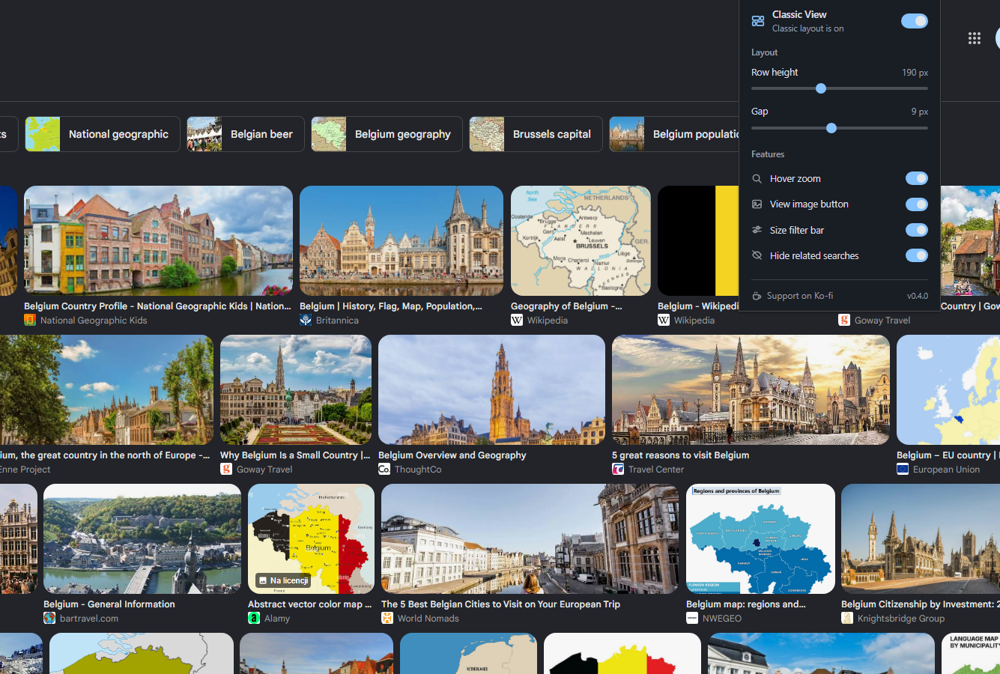
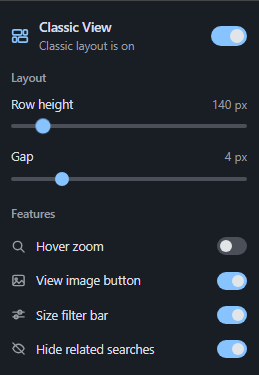

<p align="center">
  
</p>

<h1 align="center">Classic View for Google Images</h1>

<p align="center">
  A small Chrome extension that brings clean, horizontal image rows back to Google Images.
</p>

<p align="center">
  <a href="https://chromewebstore.google.com/detail/classic-view-for-google-i/ncljfdlnfncafnmcfbdkobjdpfiodfcg">
    
  </a>
</p>

<p align="center">
  <a href="https://images.hsr.gg/">Website</a>
  &middot;
  <a href="https://youtu.be/mzUMqizpvDU">Watch the demo</a>
  &middot;
  <a href="https://github.com/hsr88/classic-view-for-google-images/issues">Report a problem</a>
  &middot;
  <a href="https://ko-fi.com/hsr">Support on Ko-fi</a>
</p>



## Why this exists

I built Classic View after getting tired of the masonry layout in Google Images. It looks busy, crops thumbnails in awkward ways, and makes large result pages harder to scan on a desktop monitor.

This extension restores justified horizontal rows while leaving Google's existing page structure in place. It also brings back a direct "View Image" button and adds a few controls I wanted for everyday searches.

It is free, small, and does not collect browsing data.

## What it does

- Restores justified horizontal image rows
- Keeps the natural aspect ratio of each thumbnail
- Lets you adjust row height and spacing
- Shows a larger image preview on hover
- Adds a direct "View Image" button
- Adds quick filters for large, medium, and icon-sized images
- Hides related-search blocks and carousels
- Applies changes immediately without reloading the page
- Syncs preferences through `chrome.storage.sync`
- Supports Google country domains across Europe, the Americas, Asia, and Oceania
- Opens a prefilled GitHub issue when a layout breaks

<p align="center">
  
</p>

Every feature can be switched off separately. The main toggle returns Google Images to its original state without requiring a refresh.

## Install

### Chrome Web Store

Install the current release from the [Chrome Web Store](https://chromewebstore.google.com/detail/classic-view-for-google-i/ncljfdlnfncafnmcfbdkobjdpfiodfcg).

### From source

1. Download or clone this repository.
2. Open `chrome://extensions` in Chrome.
3. Enable **Developer mode**.
4. Select **Load unpacked**.
5. Choose the repository folder.

Open Google Images and start a search. The extension applies the layout automatically.

## How it works

Google Images loads and updates results dynamically. `content.js` finds the image-results container by its structure instead of relying only on Google's generated class names.

The extension adds its own classes and CSS variables to the existing elements. It does not remove, move, or clone result nodes. A `MutationObserver` processes images added during infinite scrolling and after navigation inside Google's single-page interface.

Original image URLs are recovered from data already present on the page. If an original URL is not available yet, the "View Image" button falls back to the largest thumbnail Chrome can find.

This approach keeps native Google behavior working and avoids conflicts with extensions such as uBlacklist.

## Project files

```text
manifest.json     Extension manifest
content.js        Layout detection and image features
styles.css        Google Images layout styles
popup.html        Settings interface
popup.js          Settings storage and live updates
popup.css         Popup styles
```

## Privacy

Classic View does not collect, store, or transmit searches, browsing history, IP addresses, or personal information.

The `storage` permission saves extension preferences in Chrome. Chrome may sync those preferences with the user's own browser profile.

The `activeTab` permission lets the report button include the current Google domain in a GitHub issue. It does not include the full URL, search query, or page content.

The extension has no analytics, advertising SDKs, external scripts, or remote code.

Read the full [privacy policy](PRIVACY_POLICY.md).

## Found a broken layout?

Google changes its interface often and sometimes rolls out different versions to different accounts or countries. Use the small "Report issue" button in the popup to open a prefilled GitHub issue.

[Open an issue](https://github.com/hsr88/classic-view-for-google-images/issues/new) and include:

- Chrome version
- Extension version
- Google domain, such as `google.com` or `google.pl`
- Screenshot of the broken result page
- Any errors visible in DevTools

Do not include private searches or personal account information.

## Development

No build step is required for the extension. Load the repository as an unpacked extension, edit the source files, then refresh it from `chrome://extensions`.

## Support the project

Classic View is free. If it makes image search less annoying, you can [support development on Ko-fi](https://ko-fi.com/hsr).

## License

The source code is available under the [MIT License](LICENSE).

## Disclaimer

Google Images is a trademark of Google LLC. Classic View for Google Images is an independent project and is not affiliated with or endorsed by Google LLC.
